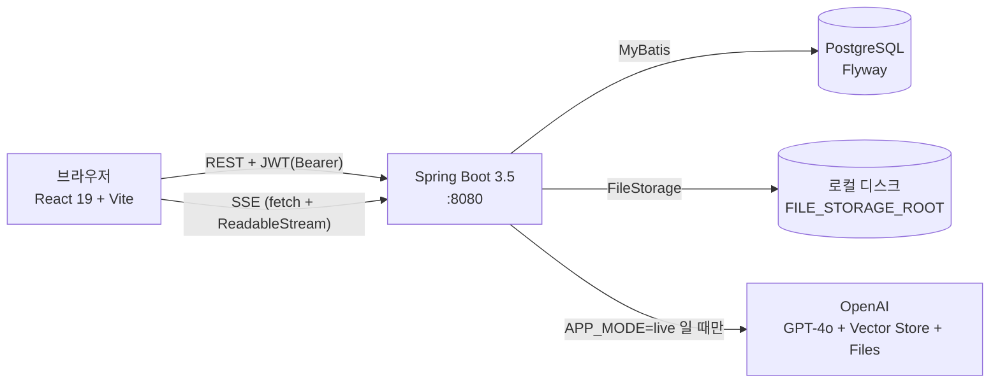
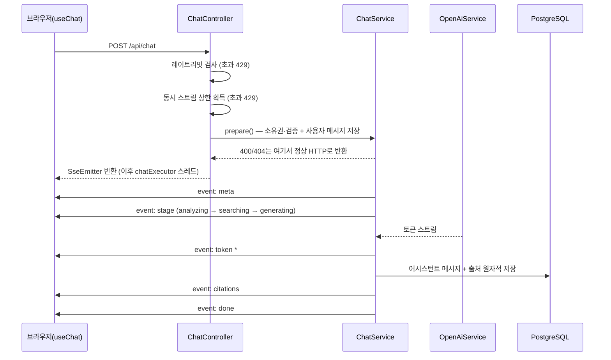
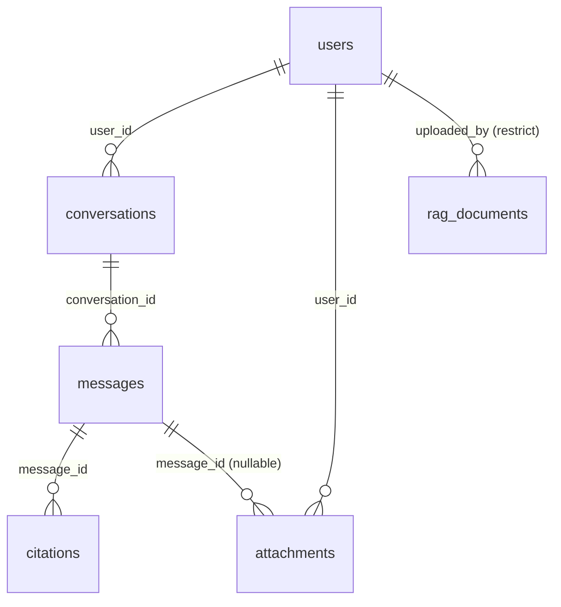

# Architecture Overview

> 구조가 바뀌면 이 문서를 함께 갱신한다. 최종 갱신 2026-09-02 — 관리자 기능(V5·V6)과 자체 호스팅 결정까지 반영돼 있다.

계층별 상세는 [frontend](./frontend.md) · [backend](./backend.md) 에 있다. 이 문서는 둘을 가로지르는 지도다.

## 시스템 구조도

모노레포 2개 배포 단위다. 프론트는 정적 번들, 백엔드는 단일 Spring Boot 인스턴스를 전제한다
(레이트리밋·동시성 상한이 인메모리라 다중 인스턴스에서는 상한이 인스턴스 수만큼 늘어난다).

## 주요 모듈

| 모듈 | 역할 | 위치 |
|------|------|------|
| 인증 | 자체 이메일/비밀번호 + JWT stateless. BCrypt 해시 | `backend/src/main/java/com/ragchatbot/security/` · `service/AuthService.java` |
| 채팅 오케스트레이션 | 동기 검증·저장(prepare) → 비동기 SSE 스트리밍(stream) | `backend/src/main/java/com/ragchatbot/service/ChatService.java` |
| LLM 경계 | `OpenAiService` 인터페이스 + Mock/Real 두 구현. `APP_MODE`로 전환 | `backend/src/main/java/com/ragchatbot/openai/` |
| 대화·메시지 | 대화 CRUD, 메시지 조회, 소유권 검증 | `backend/src/main/java/com/ragchatbot/service/ConversationService.java` |
| 첨부 | 업로드·서빙·삭제, 고아 첨부 회수 스케줄러 | `backend/src/main/java/com/ragchatbot/service/FileService.java` · `storage/` |
| 유량 제어 | 사용자별 분당 상한 + 동시 스트림 상한(back-pressure) | `service/RateLimiterService.java` · `service/ChatConcurrencyLimiter.java` |
| 화면 상태 | 대화 목록·메시지·스트리밍·진행 단계를 한 훅이 보유 | `frontend/src/hooks/useChat.ts` |
| API 클라이언트 | fetch 래퍼 + 엔드포인트 함수 + SSE 파서 | `frontend/src/lib/` |

## 페이지 URL 맵

`frontend/src/App.tsx` (React Router 8) 기준.

| 경로 | 화면 | 접근 |
|------|------|------|
| `/login` | `LoginPage` — 로그인·회원가입 | 공개 |
| `/` | `ChatPage` — 사이드바 + 메시지 목록 + 입력창 | `ProtectedRoute` (인증 필요) |
| `/me` | `MyPage` — 이름·비밀번호·테마 변경 | `ProtectedRoute` (인증 필요) |
| `/admin` | 문서 관리 · 사용자 관리 | `ProtectedRoute` + **관리자만**(아니면 `/` 로 되돌림) |
| 그 외 | `/`로 리다이렉트 | 해당 없음 |

## API 엔드포인트 맵

`backend/src/main/java/com/ragchatbot/web/` 컨트롤러 기준. 별도 표기가 없으면 **JWT Bearer 인증 필요**다.

| 메서드 | 경로 | 설명 | 인증 |
|--------|------|------|------|
| GET | `/api/health` | 헬스체크 | 공개 |
| POST | `/api/auth/signup` | 회원가입 → 토큰 + 사용자 | 공개 |
| POST | `/api/auth/login` | 로그인 → 토큰 + 사용자 | 공개 |
| GET | `/api/auth/me` | 현재 사용자 | 필요 |
| GET | `/api/profile` | 프로필 조회 | 필요 |
| PATCH | `/api/profile/name` | 이름 변경 | 필요 |
| PATCH | `/api/profile/password` | 비밀번호 변경 → **새 토큰 반환**(이전 토큰 전부 무효) | 필요 |
| PATCH | `/api/profile/theme` | 테마 변경 (`light\|dark\|system`) | 필요 |
| GET | `/api/conversations` | 대화 목록 | 필요 |
| POST | `/api/conversations` | 대화 생성 | 필요 |
| PATCH | `/api/conversations/{id}` | 대화 제목 변경 | 필요 |
| GET | `/api/conversations/{id}/messages` | 메시지 목록(출처·첨부 포함) | 필요 |
| DELETE | `/api/conversations/{id}` | 대화 삭제 (OpenAI 리소스 정리 동반) | 필요 |
| POST | `/api/files` | 첨부 업로드 (multipart, `message_id=null` 상태) | 필요 |
| DELETE | `/api/files/{id}` | 첨부 삭제 (소유자만) | 필요 |
| GET | `/api/files/{id}?token=…` | 첨부 서빙 | **서명 경로 토큰** |
| POST | `/api/chat` | 채팅 — SSE 스트림 반환 | 필요 |
| GET | `/api/admin/documents` | RAG 문서 목록 + 인덱싱 상태 | **관리자** |
| POST | `/api/admin/documents` | RAG 문서 업로드 (multipart) | **관리자** |
| DELETE | `/api/admin/documents/{id}` | RAG 문서 삭제 (소프트) | **관리자** |
| GET | `/api/admin/users` | 사용자 목록 | **관리자** |
| POST | `/api/admin/users/{id}/password-reset` | 임시 비밀번호 발급 (1회 반환) | **관리자** |

`/api/admin/**` 는 관리자가 아니면 **403 이 아니라 404** 를 돌려준다 — 관리 기능의 존재 자체를
드러내지 않는다(P-3, 소유권 위반과 같은 규칙).

응답 헤더 `X-Refresh-Token` 은 토큰 만료가 임박했을 때만 실린다(FEAT-OPS-003).
`CorsConfig` 의 노출 헤더에 등록돼 있어야 브라우저가 읽을 수 있다.

`GET /api/files/{id}`만 Bearer가 아닌 쿼리 토큰을 쓴다. ``가 Authorization 헤더를 실을 수 없기 때문이며,
검증은 `security/FileAccessTokenService.java`가 한다.

## 데이터 흐름 — 채팅 한 턴

설계상 중요한 지점:

- **검증은 동기, 스트리밍은 비동기.** 400/404/429는 SSE 안의 에러 이벤트가 아니라 정상 HTTP 응답으로 나간다.
- **동시성 상한은 `prepare` 앞에서 획득한다.** 뒤에서 거절하면 답변 없는 사용자 메시지가 대화에 남는다.
- **중단(사용자 정지·연결 끊김)은 실패가 아니다.** 받은 데까지 `status=complete` + `stopped=true`로 저장한다.
  `stopped`가 없으면 "출처 판정 전에 끊긴 답변"에 무자료 배너가 잘못 붙는다.
- **진행 단계 라벨 문자열은 LLM 구현이 소유한다.** `ChatService`는 실행 모드를 알지 못한다.
  조회 단계 라벨은 실제로 참조한 자료명을 밝히며, 그 이름은 출처 목록과 같은 값에서 파생한다
  (자세한 규칙은 [backend](./backend.md) 참고).
- 스트림 수명은 SSE emitter 타임아웃이 단독으로 정한다(기본 10분). MVC async 타임아웃은 꺼져 있다.

## 데이터 모델

`backend/src/main/resources/db/migration/` (Flyway, PostgreSQL). 모든 PK는 `uuid`.

| 테이블 | 핵심 컬럼 | 비고 |
|--------|-----------|------|
| `users` | `email`(lower 유일) · `password_hash` · `name` · `theme` · `role` · `password_changed_at` | `password_changed_at`이 이전 발급 JWT의 무효화 기준선(초 단위). `role`은 `ADMIN_EMAILS` 명단으로만 바뀜 |
| `conversations` | `user_id` · `title` · `vector_store_id` | 삭제 시 하위 전부 cascade |
| `messages` | `role`(user/assistant) · `content` · `status`(complete/error) · `stopped` · `input_tokens` · `output_tokens` | `streaming`은 DB에 없는 프론트 로컬 상태. 토큰 컬럼은 **nullable** — 0은 "정말 0"과 구분되지 않음 |
| `citations` | `message_id` · `seq` · `source_name` · `snippet` · `uri` | 출처를 영속화해 재조회 시에도 각주가 남게 함 |
| `attachments` | `user_id` · `message_id`(nullable) · `storage_path` · `file_type` · `openai_file_id` | 업로드 시점엔 메시지 미연결 → 고아는 스케줄러가 회수 |
| `rag_documents` | `filename` · `openai_file_id` · `vector_store_id` · `status` · `uploaded_by`(**restrict**) · `deleted_at` | **소프트 삭제를 쓰는 유일한 표.** 누가 언제 올리고 지웠는지가 감사 대상 |

마이그레이션 이력 : `V1__init.sql`(초기) → `V2__auth_hardening.sql`(이메일 정규화 + 토큰 무효화 기준선) →
`V3__message_stopped.sql`(중단 표시) → `V4__message_token_usage.sql`(토큰 사용량) →
`V5__user_role.sql`(관리자 권한) → `V6__rag_documents.sql`(RAG 문서).

## 외부 연동

| 대상 | 용도 | 비고 |
|------|------|------|
| OpenAI Chat (`gpt-4o`) | 답변 생성 · 이미지(비전) 입력 | `OPENAI_MODEL`로 교체 가능 |
| OpenAI Vector Store | RAG 검색 + 관리자 문서 등록 | `OPENAI_VECTOR_STORE_ID` — 대화별이 아닌 **공용 스토어**. 미설정이면 검색이 없고 문서 업로드도 400 |
| OpenAI Files | 관리자 문서 업로드 | 채팅 첨부와 별개 경로(문서만 받음) |
| 로컬 디스크 | 첨부 저장 | `FileStorage` 구현만 갈아끼우면 S3로 이동 가능 |

`APP_MODE=mock`이면 OpenAI 호출이 전혀 일어나지 않고 `OpenAiMockService`가 목업 응답을 흘린다.
`APP_MODE`는 기본값이 없어 미설정 시 `config/AppModeGuard.java`가 기동을 막는다.

## 운영 파라미터

`backend/src/main/resources/application.yml` 기준 기본값.

| 항목 | 환경변수 | 기본값 |
|------|----------|--------|
| 실행 모드 | `APP_MODE` | 없음(필수) |
| JWT 시크릿 / 만료 | `JWT_SECRET` · `JWT_EXPIRATION_MINUTES` | 없음(필수) / 120분 |
| 슬라이딩 재발급 임계 | `JWT_REFRESH_THRESHOLD_MINUTES` | 30분 (**0이면 기능 끔**) |
| 관리자 이메일 명단 | `ADMIN_EMAILS` | 없음(관리자 0명). 명단에서 빠지면 다음 기동에 강등 |
| 가입 허용 도메인 | `ALLOWED_EMAIL_DOMAINS` | 없음. **`live` 에서는 필수** — 비우면 기동 실패 |
| SSE 타임아웃 | `SSE_TIMEOUT_MS` | 600000 |
| 동시 스트림 상한 / 사용자별 | `CHAT_MAX_CONCURRENT_STREAMS` · `CHAT_MAX_CONCURRENT_PER_USER` | 8 / 1 |
| 채팅·로그인 분당 상한 | `RATELIMIT_CHAT_PER_MINUTE` · `RATELIMIT_LOGIN_PER_MINUTE` | 20 / 10 |
| 레이트리밋 키 총량 | `RATELIMIT_MAX_KEYS` | 10000 (초과 시 LRU 축출 = 카운터 리셋) |
| 첨부 저장 루트 | `FILE_STORAGE_ROOT` | `./uploads` |
| 고아 첨부 회수 | `ORPHAN_TTL_MINUTES` · `ORPHAN_CLEANUP_CRON` | 60분 / 매시 정각 |
| 업로드 하드 한도 | 해당 없음 — yml 고정값 | 파일 25MB · 요청 30MB (타입별 상한은 코드가 400으로 선검사) |
| CORS 허용 출처 | `ALLOWED_ORIGINS` | `http://localhost:5173` |

## 알려진 제약

- **단일 인스턴스 전제** — 레이트리밋·동시 스트림 카운터가 인메모리다. 수평 확장 시 공유 저장소가 필요하다.
- **레이트리밋 키 축출 = 카운터 리셋** — 키 총량 상한을 넘으면 가장 오래 안 쓴 키부터 버려지므로, 그 사용자의 카운터가 초기화된다.
- **Spring Boot 3.5.16** 은 OSS EOL 트랙이다. 업그레이드 재검토가 필요하다.
- **`V3` 이전에 저장된 중단 답변**은 정상 완료분과 구분할 표시가 없다(소급 보정하지 않음).
  `V4` 이전 메시지의 토큰 사용량도 마찬가지로 복원할 수 없어 비워 둔다.
- **관리자 명단 변경에 재기동이 필요하다.** 앱에 권한 상승 API 를 두지 않은 대가다.
- **사용량 집계 화면이 없다.** `messages` 에 기록만 하며 조회는 DB 직접 질의뿐이다.
- **첨부는 로컬 디스크에 있다.** compose 의 `uploads` 볼륨이 받으며, 볼륨을 떼면 그대로 소실된다.
- **자체 호스팅이라 전원 · 네트워크 · OS 를 직접 진다.** 서버가 꺼지면 서비스가 멈추고, 백업은
  `pg_dump` 를 정기 실행해야 생긴다. 전환 조건은 [backend](./backend.md) 「배포」에 있다.
- **관측 도구가 없다.** 장애 재현 근거가 상관 ID(REQ-OPS-002) 뿐이며 도구 도입은 별건이다.
- **OpenAI Vector Store 는 저장 용량 비례 과금**이라 문서가 늘면 월 비용이 선형으로 는다.
- **`gpt-4o` 는 노후 라인**이라 예고 없이 deprecation 공지가 날 수 있다. `OPENAI_MODEL` 이 env 로
  빠져 있어 코드 변경 없이 교체할 수 있다.
