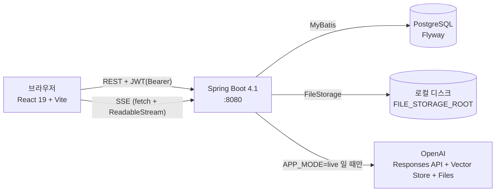
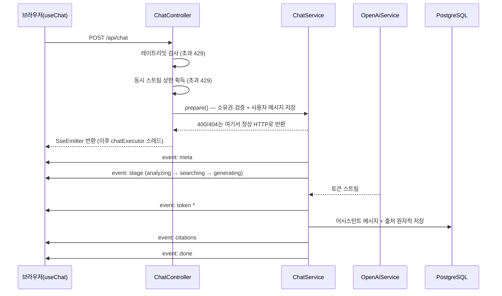

# Architecture Overview

> 구조가 바뀌면 이 문서를 함께 갱신한다. 최종 갱신 2026-10-07 — 관리자 기능(V5·V6) · 자체 호스팅 결정 ·
> Spring Boot 4.1 전환(#48) · 런칭(2026-10-06) 이후 백업 · 모델 표기(#220)까지 반영돼 있다.

계층별 상세는 [frontend](./frontend.md) · [backend](./backend.md) 에 있다. 이 문서는 둘을 가로지르는 지도다.

## 시스템 구조도

```mermaid
flowchart LR
  B["브라우저<br/>React 19 + Vite"]
  A["Spring Boot 4.1<br/>:8080"]
  D[("PostgreSQL<br/>Flyway")]
  F[("로컬 디스크<br/>FILE_STORAGE_ROOT")]
  O["OpenAI<br/>Responses API + Vector Store + Files"]

  B -- "REST + JWT(Bearer)" --> A
  B -- "SSE (fetch + ReadableStream)" --> A
  A -- MyBatis --> D
  A -- FileStorage --> F
  A -- "APP_MODE=live 일 때만" --> O
```

모노레포 2개 배포 단위다. 프론트는 정적 번들, 백엔드는 단일 Spring Boot 인스턴스를 전제한다
(레이트리밋·동시성 상한이 인메모리라 다중 인스턴스에서는 상한이 인스턴스 수만큼 늘어난다).

## 주요 모듈

| 모듈 | 역할 | 위치 |
|------|------|------|
| 인증 | 자체 이메일/비밀번호 + JWT stateless. BCrypt 해시 | `backend/src/main/java/com/ragchatbot/security/` · `service/AuthService.java` |
| 채팅 오케스트레이션 | 동기 검증·저장(prepare) → 비동기 SSE 스트리밍(stream) | `backend/src/main/java/com/ragchatbot/service/ChatService.java` |
| LLM 경계 | `OpenAiService` 인터페이스 + Mock/Real 두 구현. `APP_MODE`로 전환 | `backend/src/main/java/com/ragchatbot/openai/` |
| 대화·메시지 | 대화 CRUD, 메시지 조회, 소유권 검증 | `backend/src/main/java/com/ragchatbot/service/ConversationService.java` |
| 첨부 | 업로드·서빙·삭제, 고아 첨부 회수 스케줄러 | `backend/src/main/java/com/ragchatbot/service/FileService.java` · `storage/` |
| 유량 제어 | 사용자별 분당 상한 + 동시 스트림 상한(back-pressure) | `service/RateLimiterService.java` · `service/ChatConcurrencyLimiter.java` |
| 화면 상태 | 대화 목록·메시지·스트리밍·진행 단계를 한 훅이 보유 | `frontend/src/hooks/useChat.ts` |
| API 클라이언트 | fetch 래퍼 + 엔드포인트 함수 + SSE 파서 | `frontend/src/lib/` |

## 페이지 URL 맵

경로 · 화면 · 보호 조건은 [frontend](./frontend.md) 「라우팅」이 정본이다(`frontend/src/App.tsx` 기준).

## API 엔드포인트 맵

엔드포인트 **목록과 계약(요청·응답·에러 코드)은 [api.md](../01_specs/api.md) 가 정본**이다.
여기에는 구조를 읽는 데 필요한 묶음과 인증 경계만 둔다 — 엔드포인트가 늘 때마다 두 곳을 고치지 않으려는 것이다.

| 묶음 | 경로 | 인증 |
|------|------|------|
| 헬스체크 | `/api/health` | 공개 |
| 인증 | `/api/auth/**` | 로그인은 공개, `me` 는 필요 |
| 프로필 | `/api/profile/**` | 필요 |
| 대화·메시지 | `/api/conversations/**` | 필요 |
| 첨부 | `/api/files/**` | 업로드·삭제는 Bearer, **서빙만 서명 쿼리 토큰** |
| 채팅 | `/api/chat` | 필요 (SSE) |
| 문서 그림 | `/api/doc-figures/**` | 필요 (Bearer 로 `fetch` → Blob) |
| 관리자 | `/api/admin/**` | **관리자만** |

인증 경계에서 구조적으로 짚을 것 둘 :

- `/api/admin/**` 는 관리자가 아니면 **403 이 아니라 404** 를 돌려준다 — 관리 기능의 존재 자체를
  드러내지 않는다(P-3, 소유권 위반과 같은 규칙).
- `GET /api/files/{id}` 만 Bearer 가 아닌 쿼리 토큰을 쓴다. `` 가 Authorization 헤더를 실을 수
  없기 때문이며, 검증은 `backend/src/main/java/com/ragchatbot/security/FileAccessTokenService.java` 가 한다.

## 데이터 흐름 — 채팅 한 턴

```mermaid
sequenceDiagram
  participant U as 브라우저(useChat)
  participant C as ChatController
  participant S as ChatService
  participant O as OpenAiService
  participant DB as PostgreSQL

  U->>C: POST /api/chat
  C->>C: 레이트리밋 검사 (초과 429)
  C->>C: 동시 스트림 상한 획득 (초과 429)
  C->>S: prepare() — 소유권·검증 + 사용자 메시지 저장
  S-->>C: 400/404는 여기서 정상 HTTP로 반환
  C-->>U: SseEmitter 반환 (이후 chatExecutor 스레드)
  S->>U: event: meta
  S->>U: event: stage (analyzing → searching → generating)
  O-->>S: 토큰 스트림
  S->>U: event: token *
  S->>DB: 어시스턴트 메시지 + 출처 원자적 저장
  S->>U: event: citations
  S->>U: event: done
```

설계상 중요한 지점:

- **검증은 동기, 스트리밍은 비동기.** 400/404/429는 SSE 안의 에러 이벤트가 아니라 정상 HTTP 응답으로 나간다.
- **동시성 상한은 `prepare` 앞에서 획득한다.** 뒤에서 거절하면 답변 없는 사용자 메시지가 대화에 남는다.
- **중단(사용자 정지·연결 끊김)은 실패가 아니다.** 받은 데까지 `status=complete` + `stopped=true`로 저장한다.
  `stopped`가 없으면 "출처 판정 전에 끊긴 답변"에 무자료 배너가 잘못 붙는다.
- **진행 단계 라벨 문자열은 LLM 구현이 소유한다.** `ChatService`는 실행 모드를 알지 못한다.
  조회 단계 라벨은 실제로 참조한 자료명을 밝히며, 그 이름은 출처 목록과 같은 값에서 파생한다
  (자세한 규칙은 [backend](./backend.md) 참고).
- 스트림 수명은 SSE emitter 타임아웃이 단독으로 정한다(기본 10분). MVC async 타임아웃은 꺼져 있다.

## 데이터 모델

`backend/src/main/resources/db/migration/` (Flyway, PostgreSQL). 여섯 테이블이며 모든 PK 는 `uuid` 다.
**스키마의 소유자는 마이그레이션 SQL** 이고, 앱 코드가 `alter` 하지 않는다.

`users` — `conversations` — `messages` — `citations` 가 대화 한 줄기를 이루고, `attachments` 는
`users`(소유)와 `messages`(연결, nullable)에 걸린다. `rag_documents` 만 대화 줄기 밖에 서서
`users`(업로더)에만 걸린다.

**ER 다이어그램 · 컬럼 정의 · 인덱스 · 마이그레이션 이력은 [erd.md](../01_specs/erd.md) 가 정본**이다.
그 스키마를 그렇게 정한 이유(nullable 토큰 · 소프트 삭제 · 재조회 질의)는 [backend](./backend.md) 「DB 스키마」에 있다.

## 외부 연동

| 대상 | 용도 | 비고 |
|------|------|------|
| OpenAI 모델(`OPENAI_MODEL`, 기본 `gpt-4o` · 운영 `gpt-5.6-terra`) | 답변 생성 · 이미지(비전) 입력 | env 로 교체 가능 |
| OpenAI Vector Store | RAG 검색 + 관리자 문서 등록 | `OPENAI_VECTOR_STORE_ID` — 대화별이 아닌 **공용 스토어**. 미설정이면 검색이 없고 문서 업로드도 400 |
| OpenAI Files | 관리자 문서 업로드 | 채팅 첨부와 별개 경로(문서만 받음) |
| 로컬 디스크 | 첨부 저장 | `FileStorage` 구현만 갈아끼우면 S3로 이동 가능 |

`APP_MODE=mock`이면 OpenAI 호출이 전혀 일어나지 않고 `OpenAiMockService`가 목업 응답을 흘린다.
`APP_MODE`는 기본값이 없어 미설정 시 `config/AppModeGuard.java`가 기동을 막는다.

## 운영 파라미터

환경변수 전량 · 기본값 · 빠뜨렸을 때의 증상은 **`backend/.env.example` 이 정본**이다(기본값은
`backend/src/main/resources/application.yml`). 여기에 표로 옮기면 두 곳이 갈리므로 두지 않는다.

env 로 빠지지 않은 값 하나만 적는다 — **업로드 하드 한도**는 yml 고정값으로 파일 26MB · 요청 31MB 이고,
타입별 상한(이미지 10MB · 문서 25MB)은 코드가 400 으로 선검사한다.

## 알려진 제약

- **단일 인스턴스 전제** — 레이트리밋·동시 스트림 카운터가 인메모리다. 수평 확장 시 공유 저장소가 필요하다.
- **레이트리밋 키 축출 = 카운터 리셋** — 키 총량 상한을 넘으면 가장 오래 안 쓴 키부터 버려지므로, 그 사용자의 카운터가 초기화된다.
- **Spring Boot 4.1 트랙이다**(#48). 3.5 의 OSS 지원 종료(2026-06-30)로 `4.1.1` 로 올렸고, 4.1 의 OSS 지원은
  **2027-07** 까지다. 4.0 을 건너뛴 것은 4.0 이 2026-12 에 끝나 몇 달 뒤 같은 일을 반복하기 때문이다.
- **`V3` 이전에 저장된 중단 답변**은 정상 완료분과 구분할 표시가 없다(소급 보정하지 않음).
  `V4` 이전 메시지의 토큰 사용량도 마찬가지로 복원할 수 없어 비워 둔다.
- **업스트림이 멎으면 그 스트림의 자원은 읽기 타임아웃까지 잡혀 있다.** `app.openai.stream-read-timeout-ms`
  (기본 9분)가 SSE 타임아웃(10분)보다 짧도록 기동 시 강제되므로 **워커가 emitter 보다 오래 살지는
  않지만**(#76·#92), 워커의 블로킹 read 는 인터럽트로 깨지지 않아 그 시간만큼은 스레드와 동시 스트림
  권한이 함께 잡힌다. 전역 8자리 중 하나가 그만큼 줄어든다.
- **타임아웃 시 클라이언트에 종료 이벤트가 가지 않는다.** emitter 가 닫힌 뒤에는 `done`·`error` 를
  실을 수단이 없다. 받는 쪽이 종단 이벤트 없는 종료를 처리해야 하며, 프록시·네트워크 절단도 같은
  모양으로 도착한다.
- **업로드는 파일 전체를 힙에 올린다.** `MultipartFile.getBytes()` 라 한 요청이 최대 26MB 를 잡는다.
  사용자별 분당 상한(#95)이 병렬도를 유계로 두지만 **상한 자체가 사라지지는 않는다** — 스트리밍
  저장으로 바꾸는 것은 원인이 다른 별건이다.
- **첫 관리자의 임시 비밀번호는 바꾸기 전까지 계속 유효하다.** 「한 번만 찍는다」가 「한 번만
  유효하다」를 뜻하지는 않는다 — 변경을 강제하는 플래그가 없다. 로그는 회전시켜 잔류 창을 줄였지만
  (10MB×3), 회전 전에 그 로그를 읽을 수 있는 사람은 관리자 계정을 얻는다. 첫 로그인 후 즉시 변경할 것.
- **첨부 서빙 토큰은 비밀번호 변경으로 무효화되지 않는다.** 최대 15분(TTL) 동안 이미 발급된
  URL 이 열려 있다(#104). 기준선을 태우면 이미지 요청마다 DB 조회가 붙고 정상 사용자의 열린 화면도
  깨지므로 감수한 트레이드오프다. 근거는 [backend](./backend.md) 「인증」에 있다.
- **관리자 명단 변경에 재기동이 필요하다.** 앱에 권한 상승 API 를 두지 않은 대가다.
- **사용량 집계 화면이 없다.** `messages` 에 기록만 하며 조회는 DB 직접 질의뿐이다.
- **첨부는 로컬 디스크에 있다.** compose 의 `uploads` 볼륨이 받으며, 볼륨을 떼거나 디스크를 잃으면 마지막 백업(아래, 매일) 이후 분은 소실된다.
- **자체 호스팅이라 전원 · 네트워크 · OS 를 직접 진다.** 서버가 꺼지면 서비스가 멈춘다. 백업은
  서버 cron 이 `scripts/backup.sh` 로 DB 와 첨부를 매일 GCS 에 올린다(#132). 백업 · 복구 절차와 전환 조건은
  [backend](./backend.md) 「배포」에 있다.
- **관측 도구가 없다.** 장애 재현 근거가 상관 ID(REQ-OPS-002) 뿐이며 도구 도입은 별건이다.
- **OpenAI Vector Store 는 저장 용량 비례 과금**이라 문서가 늘면 월 비용이 선형으로 는다.
- **기본값 `gpt-4o` 는 노후 라인**이라 예고 없이 deprecation 공지가 날 수 있다. `OPENAI_MODEL` 이 env 로
  빠져 있어 코드 변경 없이 교체할 수 있다.
