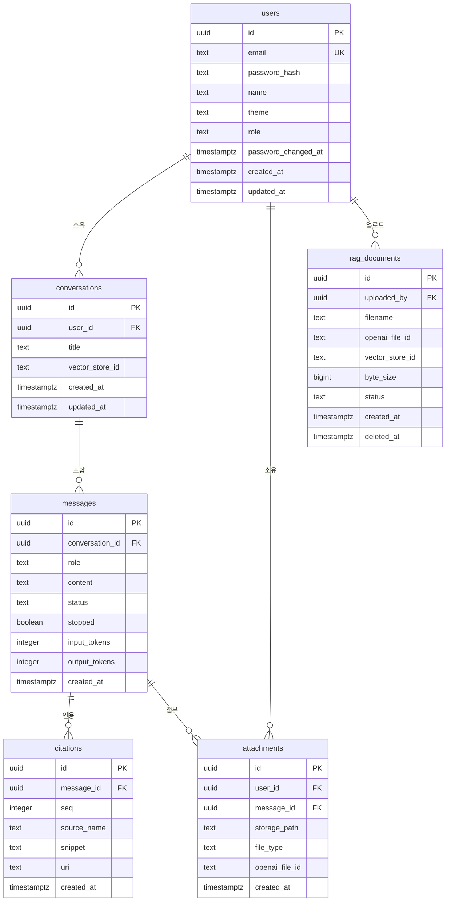

# ERD 설계서

| 항목 | 내용 |
|------|------|
| 프로젝트 | rag-chatbot |
| 문서 버전 | v1.0 |
| 최종 수정일 | 2026-08-19 |
| 작성자 | changs0124 |
| 상태 | `초안` |

---

> **템플릿과 다른 점** — 템플릿 기본값은 MySQL 관행(`BIGINT AUTO_INCREMENT` · `DATETIME` · utf8mb4 ·
> 전 테이블 소프트 삭제)이다. 이 저장소는 **PostgreSQL · uuid PK · `timestamptz` · 선택적 소프트 삭제**다.
> 사유는 5절에 적는다.
>
> **스키마의 소유자는 Flyway 마이그레이션 SQL**(`backend/src/main/resources/db/migration/`)이다.
> 이 문서와 어긋나면 마이그레이션이 정본이다.

## 1. ERD 다이어그램



**`rag_documents` 는 신설 예정**이다(FEAT-ADMIN-002). 나머지 5개 테이블은 구현돼 있다.

## 2. 테이블 정의

### users (사용자)

| 컬럼명 | 타입 | NULL | 기본값 | 설명 |
|--------|------|------|--------|------|
| id | uuid | N | `gen_random_uuid()` | PK |
| email | text | N | - | 이메일. **소문자로 정규화해 저장** |
| password_hash | text | N | - | BCrypt 해시 |
| name | text | N | - | 이름 |
| theme | text | N | `'system'` | `light` \| `dark` \| `system` |
| role | text | N | `'user'` | `user` \| `admin` (V5). 승격·강등은 `ADMIN_EMAILS` 명단으로만 |
| password_changed_at | timestamptz | N | `date_trunc('second', now())` | **이전 발급 JWT의 무효화 기준선** |
| created_at | timestamptz | N | `now()` | |
| updated_at | timestamptz | N | `now()` | |

**`password_changed_at` 의 눈금이 초인 이유** : JWT의 `iat` 가 초 단위로 내림되므로 기준선도 같은
눈금이어야 한다. 밀리초를 남기면 가입 직후 발급된 토큰이 자기보다 늦은 기준선에 걸려 곧바로 무효가 된다.

### conversations (대화)

| 컬럼명 | 타입 | NULL | 기본값 | 설명 |
|--------|------|------|--------|------|
| id | uuid | N | `gen_random_uuid()` | PK |
| user_id | uuid | N | - | FK → `users.id` **on delete cascade** |
| title | text | N | `'새 대화'` | |
| vector_store_id | text | Y | NULL | 대화 전용 스토어. **현재는 공용 스토어를 쓰므로 비어 있다** |
| created_at | timestamptz | N | `now()` | |
| updated_at | timestamptz | N | `now()` | 마지막 답변 시각. 목록 정렬 기준 |

### messages (메시지)

| 컬럼명 | 타입 | NULL | 기본값 | 설명 |
|--------|------|------|--------|------|
| id | uuid | N | `gen_random_uuid()` | PK |
| conversation_id | uuid | N | - | FK → `conversations.id` **on delete cascade** |
| role | text | N | - | `user` \| `assistant` |
| content | text | Y | NULL | 답변 본문 |
| status | text | N | `'complete'` | `complete` \| `error`. **`streaming` 은 DB에 없다**(프론트 로컬 상태) |
| stopped | boolean | N | `false` | 사용자가 끊어 **출처 판정 전에** 끝났음 |
| input_tokens | integer | Y | NULL | 입력 토큰 수(V4). 모르면 null |
| output_tokens | integer | Y | NULL | 출력 토큰 수(V4). 모르면 null |
| created_at | timestamptz | N | `now()` | |

**토큰 컬럼을 nullable 로 두는 이유** : `0` 을 기본값으로 두면 **"모르는 것"과 "정말 0"이 구분되지 않는다.**
사용자 메시지 행 · 목업 응답 · 중단된 턴 · 컬럼 이전 행에는 값이 없다. 합계를 낼 때 이 둘은 다른 뜻이어야 한다.

**`stopped` 를 따로 둔 이유** : 중단은 실패가 아니라 `status='complete'` 로 저장하기로 했는데, 그러면
무자료 배너(assistant + complete + 출처 0건)가 **출처를 판정하기도 전에 끊긴 답변**에까지 붙었다.
인용은 스트림 끝에 오므로 중단 시점에는 항상 0건이라 100% 오표시였다.

### citations (출처)

| 컬럼명 | 타입 | NULL | 기본값 | 설명 |
|--------|------|------|--------|------|
| id | uuid | N | `gen_random_uuid()` | PK |
| message_id | uuid | N | - | FK → `messages.id` **on delete cascade** |
| seq | integer | N | - | 각주 번호(1-base). 인용 순서 |
| source_name | text | N | - | 자료명. 화면 각주에 뜨는 값 |
| snippet | text | Y | NULL | 발췌. 200자로 자른다 |
| uri | text | Y | NULL | `file_search` 인용은 브라우징 가능한 URI가 없어 빈 문자열이다 |
| created_at | timestamptz | N | `now()` | |

**출처를 영속화하는 이유** : 대화를 다시 열어도 각주가 남아야 한다(REQ-RAG-002).
저장하지 않으면 재조회 시 근거가 사라져 "그때 무엇을 보고 답했는지"를 확인할 수 없다.

**문서를 지워도 이 행은 남는다.** 이미 나간 답변의 근거 표기는 사후에 바뀌지 않는다.

### attachments (첨부)

| 컬럼명 | 타입 | NULL | 기본값 | 설명 |
|--------|------|------|--------|------|
| id | uuid | N | `gen_random_uuid()` | PK |
| user_id | uuid | N | - | FK → `users.id` **on delete cascade** |
| message_id | uuid | Y | NULL | FK → `messages.id`. **업로드 시점엔 null** |
| storage_path | text | N | - | 로컬 디스크 경로 |
| file_type | text | N | - | `image` \| `document`. 현재 신규 업로드는 `image` 만 |
| openai_file_id | text | Y | NULL | 현재 미사용. 문서 첨부를 받지 않기 때문 |
| created_at | timestamptz | N | `now()` | |

**`message_id` 가 nullable 인 것이 즉시 업로드의 핵심**이다. 파일을 고르는 즉시 올리고, 전송 시점에
메시지와 연결한다. 연결되지 않은 행은 **고아**이며 회수 스케줄러가 유예 뒤 정리한다.

### rag_documents (RAG 문서) — 신설

| 컬럼명 | 타입 | NULL | 기본값 | 설명 |
|--------|------|------|--------|------|
| id | uuid | N | `gen_random_uuid()` | PK |
| filename | text | N | - | 원본 파일명. 출처 각주 이름과 대조하는 근거 |
| openai_file_id | text | N | - | 삭제 시 OpenAI 정리에 쓴다 |
| vector_store_id | text | N | - | 어느 스토어에 넣었는지. 스토어 교체 이력이 남는다 |
| byte_size | bigint | N | - | 업로드 시점 원본 크기 |
| status | text | N | `'in_progress'` | `in_progress` \| `completed` \| `failed` |
| uploaded_by | uuid | N | - | FK → `users.id` **on delete restrict** |
| created_at | timestamptz | N | `now()` | |
| deleted_at | timestamptz | Y | NULL | null이면 살아 있음 (soft delete) |

**`on delete restrict` 인 이유** : 다른 테이블은 전부 cascade 인데 여기만 다르다. 사용자를 지웠다고
문서 이력이 사라지면 감사 기록(REQ-ADMIN-002)이 성립하지 않는다. **의도된 차이**이며 마이그레이션
주석에 남긴다.

**soft delete 를 쓰는 유일한 테이블** : "언제 내려갔는가"가 감사 대상이다. 목록 조회는
`deleted_at is null` 만 본다.

## 3. 인덱스 정의

| 테이블 | 인덱스명 | 컬럼 | 유형 | 설명 |
|--------|---------|------|------|------|
| users | `users_email_key` | email | UNIQUE | V1의 원본 제약 |
| users | `idx_users_email_lower` | `lower(email)` | UNIQUE | **앱을 우회한 대소문자 중복 삽입까지 차단**(V2) |
| conversations | `idx_conversations_user` | (user_id, updated_at desc) | INDEX | 대화 목록 정렬 |
| messages | `idx_messages_conversation` | (conversation_id, created_at) | INDEX | 메시지 시간순 조회 |
| citations | `idx_citations_message` | (message_id, seq) | INDEX | 각주 번호 순 조회 |
| attachments | `idx_attachments_message` | message_id | INDEX | 메시지별 첨부 |
| attachments | `idx_attachments_user` | user_id | INDEX | 소유권 검증·고아 회수 |
| rag_documents | `idx_rag_documents_alive` | (deleted_at, created_at desc) | INDEX | **신설.** 살아 있는 문서 최신순 |

## 4. 관계 정의

| 관계 | 설명 | 타입 | 삭제 시 |
|------|------|------|---------|
| users → conversations | 사용자는 여러 대화를 가짐 | 1:N | cascade |
| users → attachments | 사용자는 여러 첨부를 가짐 | 1:N | cascade |
| users → rag_documents | 사용자는 여러 문서를 올림 | 1:N | **restrict** |
| conversations → messages | 대화는 여러 메시지를 가짐 | 1:N | cascade |
| messages → citations | 메시지는 여러 출처를 가짐 | 1:N | cascade |
| messages → attachments | 메시지는 여러 첨부를 가짐 | 1:N (nullable) | 첨부 행이 먼저 사라짐 |

**대화 삭제 시 알려진 결함** : cascade로 `attachments` 행이 먼저 사라진 뒤 파일 삭제가 실패하면,
고아 회수가 **행 기준**이라 그 파일을 구조적으로 찾지 못한다. 저장소 스캔 회수(`cleanupUnreferencedFiles`)가
이 경우를 보완한다.

## 5. 설계 원칙

템플릿 기본값과 다른 항목은 사유를 함께 적는다.

| 항목 | 이 프로젝트 | 템플릿 일반 관행 | 사유 |
|------|------------|----------------|------|
| 기본키 | **uuid** (`gen_random_uuid()`) | BIGINT AUTO_INCREMENT | 식별자가 URL·SSE 페이로드에 노출된다. 순번이면 총량과 생성 속도가 새어 나간다 |
| 시각 | **timestamptz** | DATETIME | 시간대를 값에 담는다 |
| 삭제 | **대부분 hard delete + cascade** | 전 테이블 소프트 삭제 | 사용자가 대화를 지우면 정말 지워야 한다. 감사 대상인 `rag_documents` 만 소프트 삭제 |
| 문자셋 | UTF-8 (PostgreSQL 기본) | utf8mb4 | utf8mb4는 MySQL 전용 개념이다 |
| `updated_at` | **일부 테이블만** | 전 테이블 필수 | `messages` · `citations` 는 생성 후 바뀌지 않는다. 안 바뀌는 컬럼을 두면 "갱신되겠거니" 하는 오해를 만든다 |
| `updated_at` 갱신 | **DB 트리거** (`set_updated_at()`) | 앱이 갱신 | `users` · `conversations` 에만 `trg_*_updated_at` 이 붙어 있다(V1). 앱이 빠뜨려도 값이 맞는다 |

**`rag_documents` 에는 `updated_at` 과 트리거를 두지 않는다.** 이 테이블에서 바뀌는 값은 `status` 와
`deleted_at` 둘뿐이고, 둘 다 **언제 바뀌었는지가 그 자체로 의미 있는** 값이라 별도 컬럼이 필요하다면
그때 명시적으로 추가한다. 범용 `updated_at` 은 "무엇이 언제 바뀌었는지"를 뭉갠다.
| 소유권 | **애플리케이션 코드가 검증** | DB RLS | `findByIdAndUser(...)` 형태로 조회 단계에서 막는다. RLS를 쓰지 않는다 |

**마이그레이션 이력**

| 버전 | 내용 |
|------|------|
| V1 | 초기 스키마 (users · conversations · messages · citations · attachments) |
| V2 | 이메일 소문자 정규화 + `password_changed_at` |
| V3 | `messages.stopped` |
| V4 | `messages.input_tokens` · `output_tokens` — FEAT-OPS-001 |
| V5 | `users.role` — FEAT-ADMIN-001 |
| **V6 (예정)** | `rag_documents` 신설 — FEAT-ADMIN-002 |

**기존 마이그레이션을 수정하지 않는다.** 새 변경은 항상 새 파일로 추가한다.

**소급 보정(backfill)을 하지 않는 것도 결정이다.** V3 이전의 중단 답변, V4 이전의 토큰 값은
식별할 방법이 없어 비운 채 둔다. 개발 단계 데이터라 감수한다.

## 6. 사용량 조회 SQL

FEAT-OPS-001이 들어간 뒤 비용을 보는 방법이다. 집계 화면이 없으므로 이것이 유일한 경로다.

```sql
-- 일자별 토큰 사용량 (값이 있는 행만)
select date(created_at) as day,
       count(*)           as turns,
       sum(input_tokens)  as input_tokens,
       sum(output_tokens) as output_tokens
from messages
where role = 'assistant' and input_tokens is not null
group by 1
order by 1 desc;
```

`input_tokens is not null` 조건이 중요하다. 빼면 목업·중단 턴이 0으로 섞여 턴당 평균이 실제보다
낮게 나온다.

```sql
-- 살아 있는 RAG 문서와 올린 사람
select d.filename, d.status, d.byte_size, u.name as uploaded_by, d.created_at
from rag_documents d
join users u on u.id = d.uploaded_by
where d.deleted_at is null
order by d.created_at desc;
```
