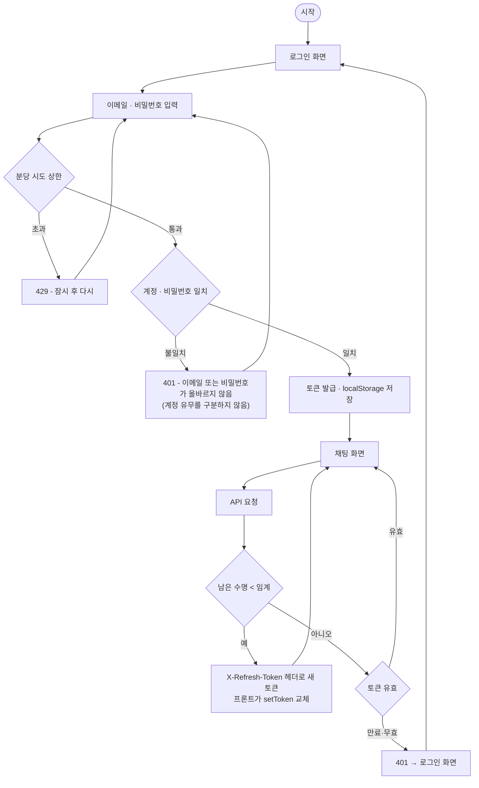
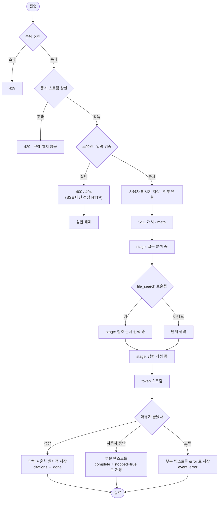
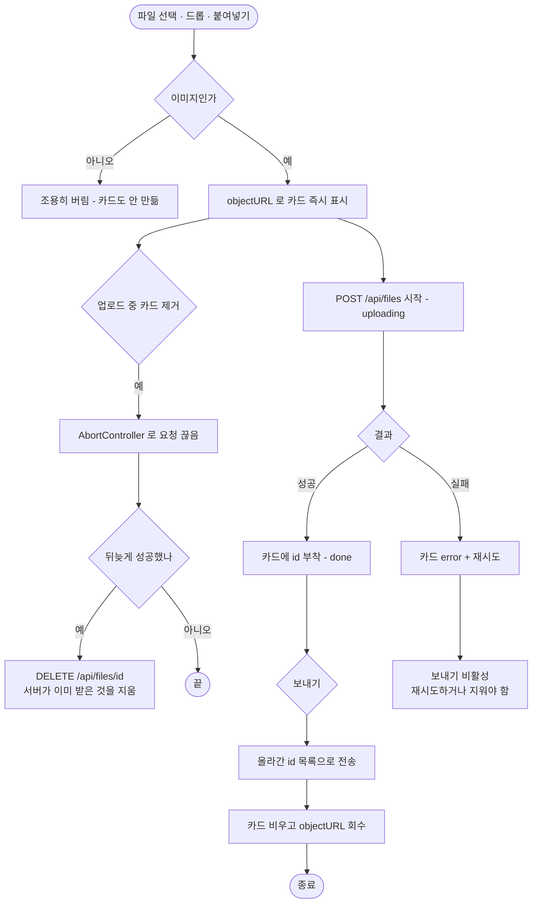
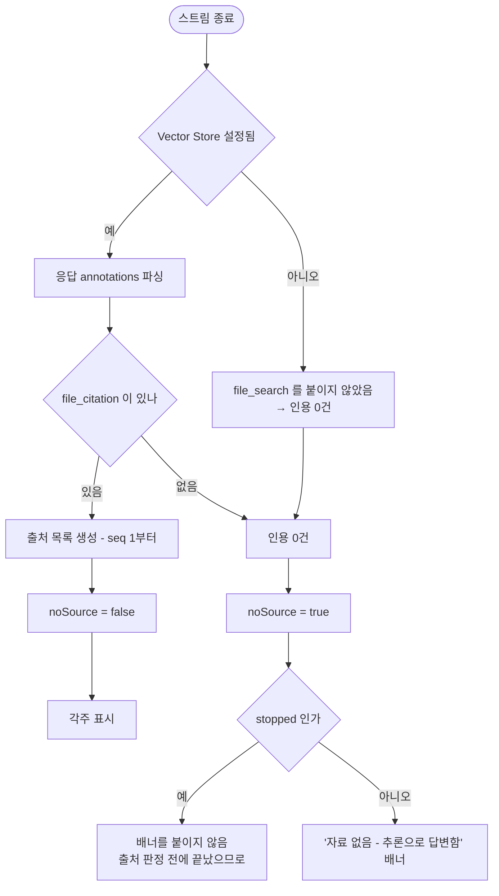
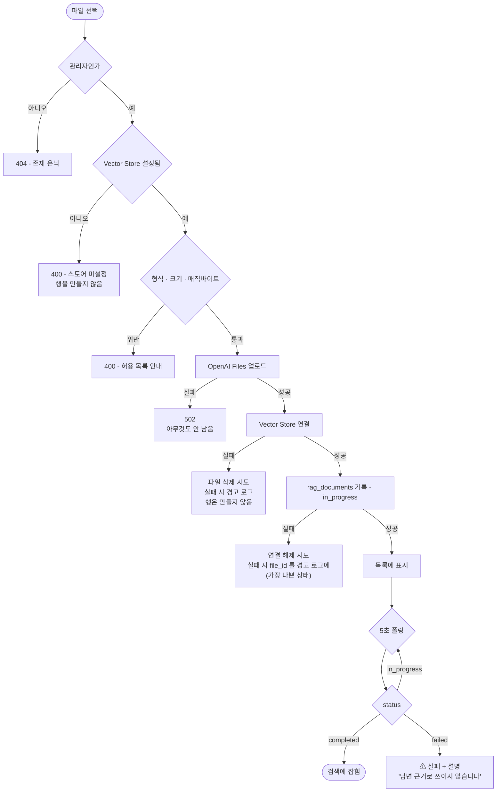
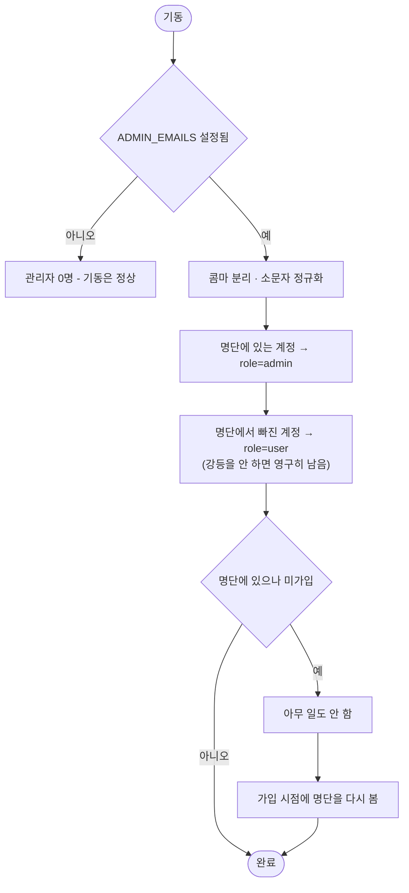

# 플로우차트

| 항목 | 내용 |
|------|------|
| 프로젝트 | rag-chatbot |
| 문서 버전 | v1.0 |
| 최종 수정일 | 2026-08-19 |
| 작성자 | changs0124 |
| 상태 | `초안` |

---

> **중복 주의** — `docs/02_architecture/overview.md` 에 "채팅 한 턴" 시퀀스 다이어그램이 이미 있다.
> 그쪽은 **컴포넌트 간 호출 순서**(누가 누구를 부르는가)를 그리고, 이 문서는 **사용자 관점의 분기**
> (어떤 조건에서 무엇이 갈리는가)를 그린다. 둘이 어긋나면 `overview.md` 가 정본이다.

## 1. 플로우 목록

| ID | 플로우명 | 관련 기능 | 우선순위 | 상태 |
|----|---------|---------|---------|------|
| FLOW-AUTH-001 | 로그인 · 세션 유지 | FEAT-OPS-003 | High | 일부 미구현 |
| FLOW-CHAT-001 | 채팅 한 턴 (검증 → 스트림 → 저장) | FEAT-CHAT-* | High | 구현됨 |
| FLOW-CHAT-002 | 첨부 즉시 업로드 | FEAT-CHAT-001 | High | 구현됨 |
| FLOW-RAG-001 | 무자료 판정 | REQ-RAG-003 | High | 구현됨 |
| FLOW-ADMIN-001 | RAG 문서 업로드 | FEAT-ADMIN-002 | High | **미구현** |
| FLOW-ADMIN-002 | 관리자 권한 동기화 | FEAT-ADMIN-001 | Medium | **미구현** |

---

## 2. 플로우 상세

### FLOW-AUTH-001: 로그인 · 세션 유지

**분기 조건:**

| 조건 | 결과 |
|------|------|
| 계정 미존재 · 비밀번호 불일치 | **같은 401 응답**. 존재를 은닉한다 |
| 분당 로그인 시도 초과 | 429. 키는 정규화된 이메일이며 IP가 아니다 |
| 남은 수명 < `JWT_REFRESH_THRESHOLD_MINUTES` | 응답 헤더로 새 토큰 (미구현) |
| 비밀번호 변경 이후의 옛 토큰 | 401. `password_changed_at` 기준선에 걸린다 |
| **자격 증명 경로(`/auth/login` · `/auth/signup` · `/profile/password`)의 401** | **로그아웃시키지 않는다.** "방금 넣은 값이 틀렸다"는 뜻이다 |

**임계가 0이면 재발급을 하지 않는다** — 종전 고정 만료 동작으로 되돌리는 경로다.

---

### FLOW-CHAT-001: 채팅 한 턴

**분기 조건:**

| 조건 | 결과 |
|------|------|
| 동시 스트림 상한 초과 | 429. **`prepare` 앞에서 획득한다** — 뒤에서 거절하면 답변 없는 사용자 메시지가 대화에 남는다 |
| `file_search` 이벤트가 안 옴 | **검색 단계를 보내지 않는다.** 근거 없는 단계를 만들지 않는다(P-10) |
| 첫 토큰 이후 도착한 단계 | 보내지 않는다. 답변이 시작된 뒤 진행 단계를 올리면 순서가 거꾸로 보인다 |
| 사용자 중단 | **실패가 아니다.** 받은 데까지 `complete` 로 저장한다 |
| 중단인데 받은 것이 없음 | **아무것도 저장하지 않는다.** 빈 버블을 남기면 새로고침에 사라져 화면과 재조회가 어긋난다 |
| 완료 이벤트 없이 스트림 종료 | **오류로 처리한다.** 조용히 무자료 성공으로 위장하지 않는다 |

---

### FLOW-CHAT-002: 첨부 즉시 업로드

**분기 조건:**

| 조건 | 결과 |
|------|------|
| 업로드 중 · 실패 카드가 있음 | **보내기 버튼 비활성.** 빠진 채 전송되는 경로를 막는다 |
| 지운 카드의 업로드가 뒤늦게 성공 | 서버에서 지운다. 중단은 요청을 끊을 뿐 **서버가 받은 것을 되돌리지 않는다** |
| 전송하지 않고 화면을 떠남 | `message_id=null` 고아. 회수 크론이 유예 뒤 정리 |
| objectURL 회수 누락 | 탭 메모리가 계속 늘어난다. 회수 지점은 **카드 제거 · 전송 완료 · 언마운트** 세 곳 |

---

### FLOW-RAG-001: 무자료 판정

**분기 조건:**

| 조건 | 결과 |
|------|------|
| `OPENAI_VECTOR_STORE_ID` 미설정 | 검색을 아예 하지 않아 **모든 답변이 무자료**가 된다 |
| 인용 0건 + `stopped=false` | 무자료 배너 |
| 인용 0건 + **`stopped=true`** | **배너를 붙이지 않는다.** 중단은 인용이 오기 전에 끝나 항상 0건이라, 붙이면 100% 거짓이 된다 |
| 검색은 됐으나 본문이 인용하지 않은 파일 | 출처에서 제외한다. 검색된 것과 인용된 것은 다르다 |

**판정 규칙은 Mock · Real 공통으로 `citations.isEmpty()` 하나다.** 텍스트 접두가 아니라 플래그로
알리는 이유는, 라이브에서 인용 유무를 스트림이 끝나야 알 수 있어 **이미 흘려보낸 토큰 앞에 접두를
붙일 수 없기** 때문이다.

---

### FLOW-ADMIN-001: RAG 문서 업로드 (미구현)

**분기 조건:**

| 조건 | 결과 |
|------|------|
| 비관리자 | 404. 403이 아니다 |
| 스토어 미설정 | 400. **행을 만들지 않는다** — 어디에도 없는 문서가 목록에만 뜨는 상태를 막는다 |
| 4단계 실패 | OpenAI에 고아 파일. 즉시 삭제 시도 |
| 5단계 실패 | **스토어에는 있는데 기록이 없다.** 화면에서 안 보이니 지울 수도 없어 가장 나쁘다 |
| `in_progress` 행이 하나도 없음 | **폴링을 멈춘다.** 안 멈추면 배경에서 계속 돈다 |
| 인덱싱 실패 | 아이콘만 두지 않고 **한 줄 설명을 붙인다.** 아이콘만 보면 "올라갔으니 됐다"고 읽는다 |

---

### FLOW-ADMIN-002: 관리자 권한 동기화 (미구현)

**분기 조건:**

| 조건 | 결과 |
|------|------|
| 대소문자가 다른 이메일 | 정규화 후 비교하므로 승격된다 |
| 명단에서 이메일을 지움 | **다음 기동에 강등된다.** 승격만 하면 한 번 관리자가 된 계정이 영구히 남는다 |
| 명단에 미가입 이메일 | 기동을 막지 않는다. 가입 시점에 반영된다 |
| 명단 변경 | **재기동이 필요하다.** 감수하는 약점 |

**역할을 JWT에 담지 않으므로 강등이 즉시 반영된다.** 담았다면 토큰 만료까지 관리자로 남는다.
